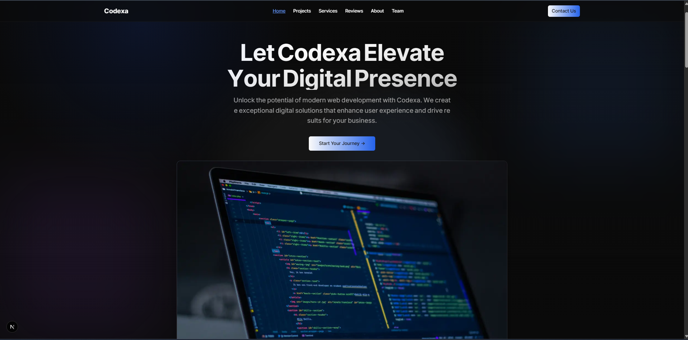

# TonmoyBD

**TonmoyBD** is a web development agency focused on creating innovative and scalable web solutions. Our mission is to provide high-quality, user-friendly websites and applications that drive growth and success for our clients.

  

## Technologies Used

- **Frontend**: React.js, Next.js, Tailwind CSS, TypeScript
- **Backend**: Node.js, Express.js, Prisma, PostgreSQL
- **Others**: JWT (for authentication), Axios (for API requests), SSLCommerz/ShurjoPay (payment integration)

## Features

- Custom website and web app development
- E-commerce solutions
- Event planning systems
- Content management systems
- Payment gateway integrations

## Services

- **Website Development**: We specialize in responsive websites tailored to your business needs.
- **Web Application Development**: Scalable and secure web apps using the latest technologies.
- **Mobile-Responsive Design**: Ensuring your website looks great on all devices.
- **SEO and Performance Optimization**: Helping you rank higher and deliver better performance.
- **Payment Integration**: Secure payment solutions with SSLCommerz/ShurjoPay.

## Contact Us

For inquiries or project collaborations, feel free to reach out!

Email: contact@Tonmoybd.com  
Phone: +8801XXXXXXXXX  
Website: [Tonmoybd.com](https://Tonmoybd.com)

## Installation

If you are looking to set up the project locally, you can follow these steps:

### 1. Clone the repository:
```bash
git clone https://github.com/your-repo/Tonmoybd.git
npm install
npm run dev
```


 

